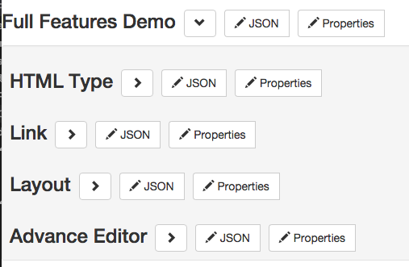

该项目意在指导开发人员在[json-editor](https://github.com/jdorn/json-editor)之上新增自定义的`format`

# 写在最前面

想看该项目的demo的运行效果，请先安装`node`，然后`npm install`，然后就可以简单粗野地把`index.html`拖到浏览器了

增加自定义控件前，先浏览下`demos/full-features/index.html`，看已有功能是否满足需求再决定是否有必要自定义



# editor的生命周期

每一个editor都直接或间接继承自`JSONEditor.AbstractEditor`（源码文件为editor.js）,它的生命周期方法为：

**init** -> **preBuild**(表单元素未初始化) -> **build**(初始化表单元素) -> **postBuild**(表单元素已渲染) -> **destroy**

# 需重点研究的两个源码文件

`editor.js`: 所有editor的基类，附上官方对该类的[说明](https://github.com/jdorn/json-editor/wiki#editor-srceditorjs)

`theme.js`: 构建表单元素常用的方法，通过这些方法构造的表单HTML结构可以套用多种样式框架

# 自定义控件需要重点关注以下几个方法

需要考虑是否需要重写以支持每个控件最基本的配置功能

- enable / disable

- getValue / setValue

- showValidationErrors

最后记得值更改的时候调用`onChange`以通知父级元素

# 如何自定义操作控件？

TODO

# 如何自定义布局？

TODO

# 如何自定义表单控件 之 Vue组件？

可参考`demos/custom-control-vue/index.js`

### 1. 增加resolver

```
JSONEditor.defaults.resolvers.unshift(function (schema) { ... })
```

如下：

```
JSONEditor.defaults.resolvers.unshift(function (schema) {
  if (schema.type === "string" && schema.format === "custom-type") return "customType";
});
```

### 2. 增加editor

```
JSONEditor.defaults.editors.xxx = JSONEditor.AbstractEditor.extend({ ... })
```

其中`xxx`为自定义类型名，如下：

```
JSONEditor.defaults.editors.customType = JSONEditor.AbstractEditor.extend({
  vm: null, // 保存vue实例对象
  setValue: function(value) {
    ...
  },
  build: function () {
    ...
  }
});
```

### 3.将Vue组件整合进去

以`customType`为例

```
JSONEditor.defaults.editors.customType = JSONEditor.AbstractEditor.extend({
  vm: null,
  setValue: function(value) {
    var changed = this.getValue() !== value;
    if (changed) {
      this.vm.$data.modelValue = value;
      this.value = value;
    }
    this.onChange(changed); // 通知值发生变化 - 父级元素会自动刷新值
  },
  build: function () {
    var self = this;

    // 取得表单控件相关显示信息
    if (!this.options.compact) this.header = this.label = this.theme.getFormInputLabel(this.getTitle());
    if(this.schema.description) this.description = this.theme.getFormInputDescription(this.schema.description);

    // 构造表单控件
    this.wrapper = document.createElement('div');
    this.wrapper.innerHTML = [
      '<vue-comp :model-value="modelValue" :on-model-value-changed="modelValueChanged"></vue-comp>'
    ].join('');
    this.control = this.theme.getFormControl(this.label, this.wrapper, this.description);
    this.container.appendChild(this.control);

    // 启动Vue
    this.vm = new Vue({
      el: this.control,
      data: {
        modelValue: '',
      },
      methods: {
        modelValueChanged(newVal) {
          self.setValue(newVal); // 同步json-editor value
        }
      }
    });
  }
});
```

接下来剖析下上面的代码

- `画`出表单控件

```
// 取得表单控件相关显示信息
if (!this.options.compact) this.header = this.label = this.theme.getFormInputLabel(this.getTitle());
if(this.schema.description) this.description = this.theme.getFormInputDescription(this.schema.description);

// 构造表单控件
this.wrapper = document.createElement('div');
this.wrapper.innerHTML = [
  '<vue-comp :model-value="modelValue" :on-model-value-changed="modelValueChanged"></vue-comp>'
].join('');
this.control = this.theme.getFormControl(this.label, this.wrapper, this.description);
this.container.appendChild(this.control);
```

- 渲染Vue组件

```
this.vm = new Vue({
  el: this.control,
  ...
});
```

- 同步数据 json-editor => Vue 组件

```
setValue: function(value) {
  var changed = this.getValue() !== value;
  if (changed) {
    this.vm.$data.modelValue = value; // 同步数据: json-editor => Vue 组件
    this.value = value;
  }
  this.onChange(changed); // 通知值发生变化 - 父级元素会自动刷新值
}
```

- 同步数据 Vue组件 =》json-editor

```
methods: {
  modelValueChanged(newVal) {
    self.setValue(newVal); // 同步数据：Vue组件 =》json-editor
  }
}
```